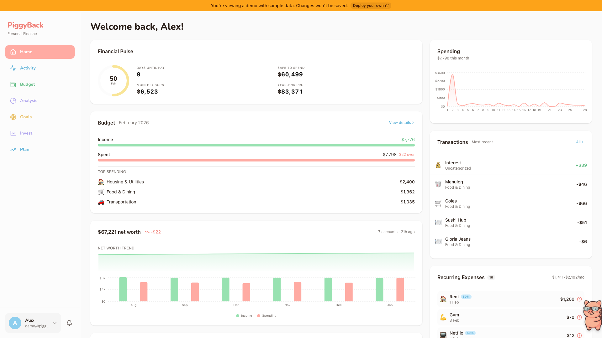
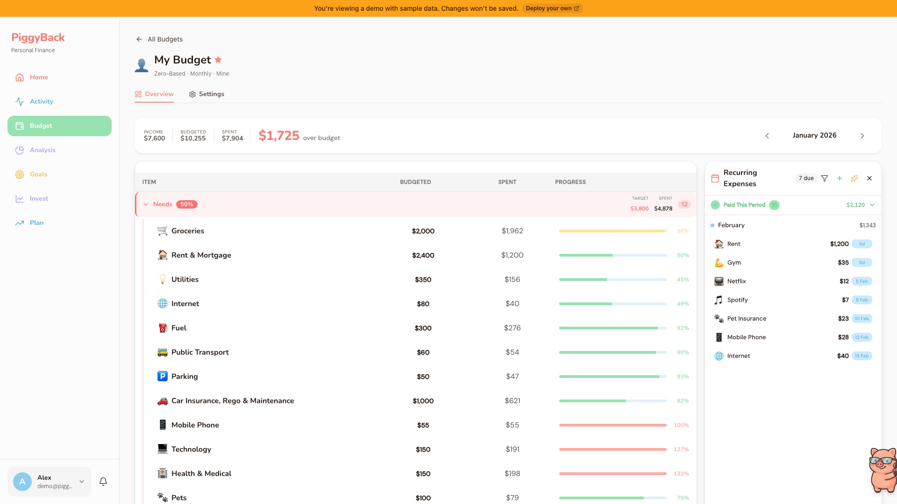
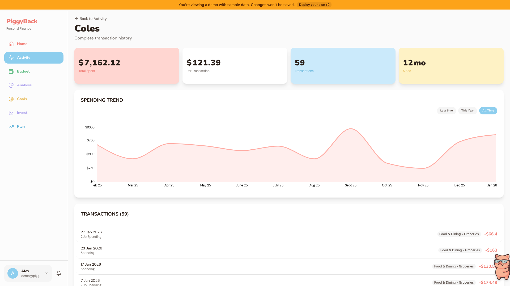
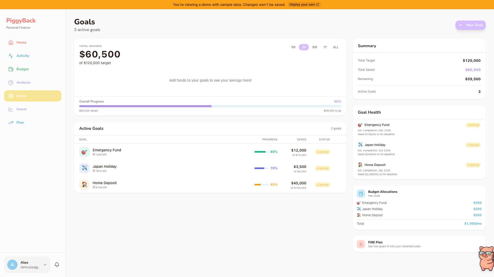
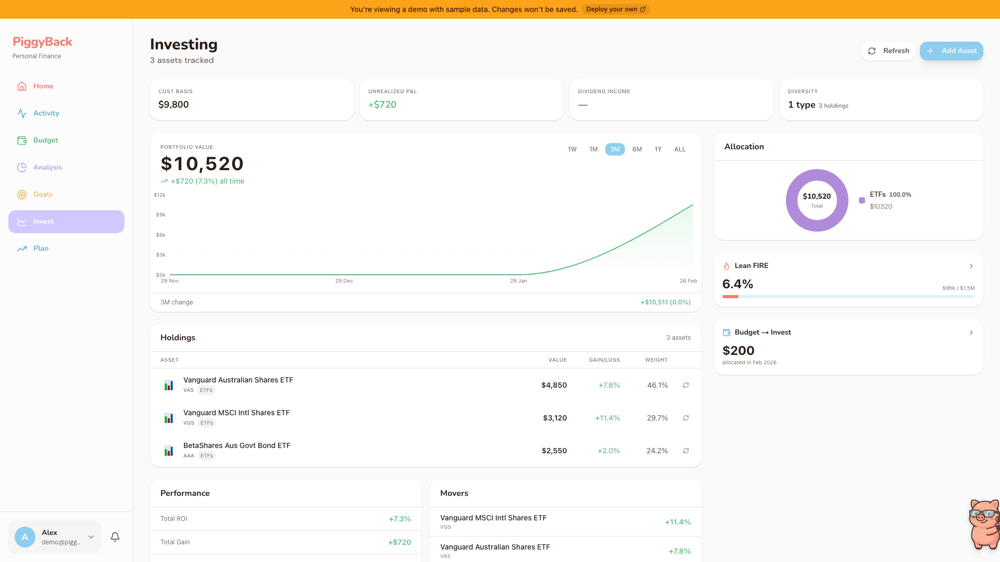
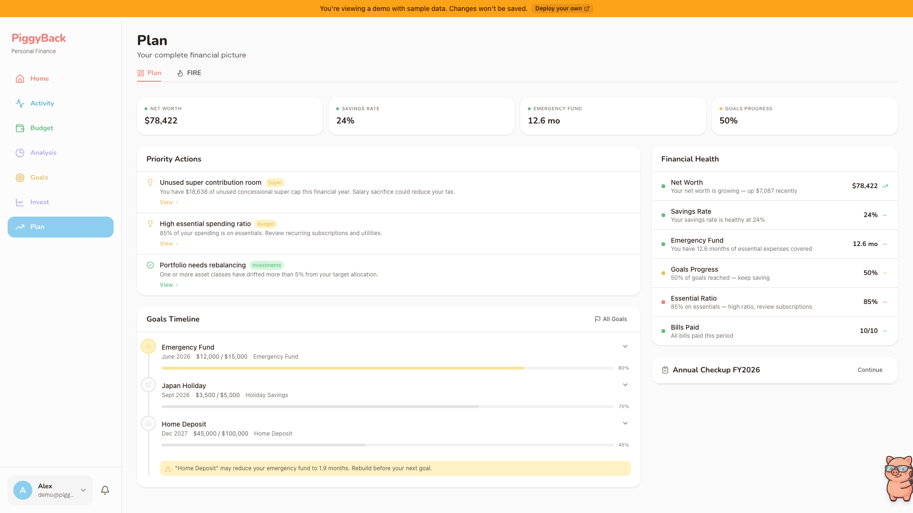
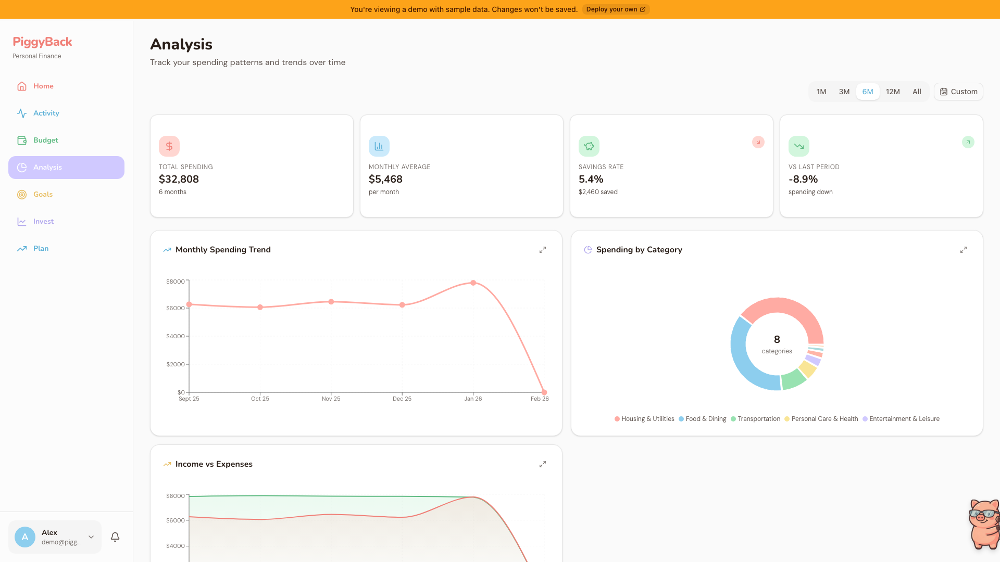

# PiggyBack

[]()
[](https://opensource.org/licenses/MIT)
[](https://securityscorecards.dev/viewer/?uri=github.com/BenLaurenson/PiggyBack)
[](https://www.bestpractices.dev/projects/10407)
[](https://nextjs.org/)
[](https://react.dev/)
[](https://supabase.com/)
[](https://www.typescriptlang.org/)
[](https://tailwindcss.com/)

Your finances on autopilot with Up Bank. Auto-syncing transactions, budgets, savings goals, and a 35-tool AI financial assistant. Self-hosted on Vercel + Supabase.

<p align="center">
  
</p>

<p align="center">
  <a href="https://piggyback.finance/home">Check out the live demo</a>
</p>

## Overview

PiggyBack syncs with [Up Bank](https://up.com.au/) to automatically import your accounts and transactions, then provides tools to manage your finances. It features shared budgets with fair-split calculations, savings goal tracking linked to Up savers, recurring expense detection, investment portfolio tracking with live price updates from Yahoo Finance and CoinGecko, FIRE (Financial Independence) planning, and an AI-powered financial assistant.

Each user connects their own Up Bank account using a personal access token. All financial data is stored in the user's own Supabase database with row-level security -- no data is shared with third parties.

## Features

- **Up Bank Sync** -- Automatic import of accounts, transactions, categories, and tags via webhooks
- **Couples Partnership** -- Shared financial view with your partner, income-weighted expense splitting
- **Zero-Based Budgeting** -- Category budgets with real-time spending tracking and period-aware calculations
- **Savings Goals** -- Visual progress tracking linked to Up Bank saver accounts
- **Recurring Expenses** -- Auto-detection and tracking of subscriptions and bills
- **Investment Portfolio** -- Track stocks, ETFs, crypto, and property with live price updates (Yahoo Finance for ASX/US stocks, CoinGecko for crypto)
- **Watchlist** -- Track investments you don't own yet with price monitoring
- **Target Allocations** -- Set portfolio allocation targets and see rebalancing recommendations
- **FIRE Planning** -- Australian two-bucket FIRE calculator with lean/regular/fat/coast variants
- **AI Assistant** -- Chat-based financial insights powered by your choice of Google, OpenAI, or Anthropic
- **Net Worth Tracking** -- Real-time snapshots via webhook with historical charts
- **Customizable UI** -- Multiple themes, accent colors, and layout configurations

## Screenshots

<details>
<summary>Budget Tracking</summary>

</details>

<details>
<summary>Transaction Activity</summary>

</details>

<details>
<summary>Savings Goals</summary>

</details>

<details>
<summary>Investment Portfolio</summary>

</details>

<details>
<summary>FIRE Planning</summary>

</details>

<details>
<summary>Spending Analysis</summary>

</details>

## Tech Stack

| Layer | Technology |
|-------|-----------|
| Framework | [Next.js 16](https://nextjs.org/) (App Router, Turbopack) |
| UI | [React 19](https://react.dev/), [Tailwind CSS 4](https://tailwindcss.com/), [shadcn/ui](https://ui.shadcn.com/) |
| Database | [Supabase](https://supabase.com/) (PostgreSQL with Row Level Security) |
| Banking API | [Up Bank API](https://developer.up.com.au/) |
| Price APIs | [Yahoo Finance](https://finance.yahoo.com/) (stocks/ETFs), [CoinGecko](https://www.coingecko.com/) (crypto) |
| AI | [Vercel AI SDK](https://sdk.vercel.ai/) with multi-provider support |
| Testing | [Vitest](https://vitest.dev/) (1120+ tests across 50 test files) |
| Charts | [Recharts](https://recharts.org/) |
| Animations | [Framer Motion](https://www.framer.com/motion/) |
| Deployment | [Vercel](https://vercel.com/) |

## Getting Started

### Prerequisites

- [Node.js](https://nodejs.org/) 20+
- [npm](https://www.npmjs.com/) or [pnpm](https://pnpm.io/)
- A [Supabase](https://supabase.com/) account (free tier works)
- An [Up Bank](https://up.com.au/) account (Australian neobank)

### 1. Clone the repository

```bash
git clone https://github.com/BenLaurenson/PiggyBack.git
cd PiggyBack
npm install
```

### 2. Set up Supabase

Create a new Supabase project, then apply the database migrations in order:

```bash
# Apply all migrations from supabase/migrations/ via the Supabase dashboard SQL editor
# or using the Supabase CLI
```

The `supabase/migrations/` directory contains a single consolidated migration that sets up all tables, RLS policies, and functions.

### 3. Configure environment variables

Copy the example file and fill in your values:

```bash
cp .env.local.example .env.local
```

Required variables:

| Variable | Description |
|----------|-------------|
| `NEXT_PUBLIC_SUPABASE_URL` | Your Supabase project URL |
| `NEXT_PUBLIC_SUPABASE_ANON_KEY` | Your Supabase publishable/anon key |
| `SUPABASE_SERVICE_ROLE_KEY` | Your Supabase service role key (Settings > API) |
| `UP_API_ENCRYPTION_KEY` | 64-character hex key for encrypting stored Up API tokens (see `.env.local.example`) |
| `NEXT_PUBLIC_APP_URL` | Your app URL (e.g. `http://localhost:3000` for local) |

### 4. Run the development server

```bash
npm run dev
```

Open [http://localhost:3005](http://localhost:3005) to access the app.

### 5. Connect Up Bank

1. Sign up / log in to PiggyBack
2. Go to Settings > Up Bank Connection
3. Enter your Up Bank Personal Access Token (from the Up app or [api.up.com.au](https://api.up.com.au))
4. Your accounts and transactions will sync automatically

## Project Structure

```
PiggyBack/
├── src/
│   ├── app/                    # Next.js App Router
│   │   ├── (app)/              # Authenticated app pages (33 pages)
│   │   │   ├── home/           # Dashboard overview
│   │   │   ├── activity/       # Transaction history & income
│   │   │   ├── analysis/       # Spending analysis
│   │   │   ├── budget/         # Budget management
│   │   │   ├── goals/          # Savings goals
│   │   │   ├── invest/         # Investment portfolio & watchlist
│   │   │   ├── plan/           # FIRE planning
│   │   │   ├── notifications/  # Notification centre
│   │   │   └── settings/       # User settings (10 sub-pages)
│   │   ├── actions/            # 13 server action files
│   │   ├── api/                # 34 REST API routes
│   │   │   ├── ai/             # AI chat endpoint
│   │   │   ├── budget/         # Budget calculation APIs
│   │   │   ├── upbank/         # Up Bank webhook & sync
│   │   │   └── ...
│   │   └── auth/               # Auth callback
│   ├── components/             # React components (125 files across 18 domains)
│   │   ├── ui/                 # shadcn/ui primitives
│   │   ├── ai/                 # AI chat interface
│   │   ├── budget/             # Budget dashboard
│   │   ├── invest/             # Investment portfolio views
│   │   └── ...
│   ├── lib/                    # Utilities and business logic (45 files)
│   │   ├── __tests__/          # 50 test files (1090+ tests)
│   │   ├── price-apis.ts       # Yahoo Finance + CoinGecko price fetching
│   │   ├── portfolio-aggregation.ts  # Portfolio timeline & metrics
│   │   ├── invest-calculations.ts    # Investment page calculations
│   │   ├── fire-calculations.ts      # FIRE planning engine
│   │   └── ...
│   └── utils/
│       └── supabase/           # Supabase client setup
├── documentation/              # Developer documentation
├── supabase/
│   └── migrations/             # Consolidated initial schema
└── package.json
```

## Up Bank API Usage

This app uses the [Up Bank API](https://developer.up.com.au/) for personal banking data. Per Up's [API Acceptable Use Policy](https://up.com.au/api-acceptable-use-policy/):

- The API is for **personal use only**
- Each user must use their **own personal access token**
- Tokens must **not be shared** with third parties
- Do not extract merchant data for commercial use

Your Up API token is encrypted at rest in the database and is never exposed in client-side code.

## Running Tests

```bash
npm test          # Watch mode
npm run test:run  # Single run
```

The test suite covers 1120+ tests across 50 test files, including:

- Budget calculations (zero-based, shared budgets, period helpers, income frequency)
- Investment logic (price APIs, portfolio aggregation, FIRE calculations, invest calculations)
- Expense projections and matching
- AI tool definitions

## Deployment

Two deployment guides are available:

- **[Deploy to the Cloud](DEPLOY-CLOUD.md)** — Vercel + hosted Supabase (free tier, quickest setup)
- **[Deploy Locally](DEPLOY-LOCAL.md)** — Docker + local or hosted Supabase (self-hosted, maximum privacy)

## Documentation

Detailed documentation for contributors and developers:

```
documentation/
├── architecture/
│   ├── overview.md              # System architecture and design decisions
│   ├── data-flow.md             # Data flow between components
│   ├── deployment.md            # Deployment architecture
│   └── tech-stack.md            # Technology choices and rationale
├── features/
│   ├── ai-system.md             # AI assistant (35 tools, multi-provider)
│   ├── budget-system.md         # Budget engine and zero-based budgeting
│   ├── fire-system.md           # FIRE calculator and planning
│   ├── income-tracking.md       # Income detection and tracking
│   ├── investment-tracking.md   # Portfolio tracking and price APIs
│   ├── library-reference.md     # Shared utility library reference
│   ├── recurring-expenses.md    # Expense detection and matching
│   └── up-bank-integration.md   # Up Bank API and webhook integration
├── database/
│   ├── schema.md                # Database schema reference
│   └── rls-policies.md          # Row Level Security policies
├── api-routes/
│   ├── README.md                # API routes overview
│   └── server-actions.md        # Server actions reference
├── up-bank-api/
│   ├── README.md                # Up Bank API overview
│   ├── accounts.md              # Account endpoints
│   ├── transactions.md          # Transaction endpoints
│   ├── categories.md            # Category endpoints
│   ├── tags.md                  # Tag endpoints
│   ├── webhooks.md              # Webhook setup and handling
│   └── pagination-and-errors.md # Pagination and error handling
├── components/README.md         # Component architecture
├── settings/README.md           # Settings system
└── onboarding/README.md         # Onboarding flow
```

## Security

PiggyBack takes security seriously. The project maintains an [OpenSSF Best Practices](https://www.bestpractices.dev/projects/10407) passing badge and is continuously monitored by the [OpenSSF Scorecard](https://securityscorecards.dev/viewer/?uri=github.com/BenLaurenson/PiggyBack).

### CI/CD Security Pipeline

Every push and pull request is scanned by:

| Tool | What It Does |
|------|-------------|
| [CodeQL](https://github.com/BenLaurenson/PiggyBack/blob/main/.github/workflows/codeql.yml) | Static application security testing (SAST) for JS/TS — detects XSS, injection, data flow vulnerabilities |
| [Trivy](https://github.com/BenLaurenson/PiggyBack/blob/main/.github/workflows/trivy.yml) | Filesystem vulnerability scanning, Docker container scanning, and SBOM generation |
| [Gitleaks](https://github.com/BenLaurenson/PiggyBack/blob/main/.github/workflows/secrets-scan.yml) | Secret detection in commits (also runs as a pre-commit hook) |
| [Dependency Review](https://github.com/BenLaurenson/PiggyBack/blob/main/.github/workflows/dependency-review.yml) | Blocks PRs that introduce vulnerable or restrictively-licensed dependencies |
| [Snyk](https://github.com/BenLaurenson/PiggyBack/blob/main/.github/workflows/snyk.yml) | Code and dependency scanning (SAST + SCA) for application and open-source vulnerabilities |
| [OpenSSF Scorecard](https://github.com/BenLaurenson/PiggyBack/blob/main/.github/workflows/scorecard.yml) | Automated supply chain security health scoring |
| [SLSA Provenance](https://github.com/BenLaurenson/PiggyBack/blob/main/.github/workflows/slsa-provenance.yml) | Supply chain integrity and artifact provenance verification |
| [Dependabot](https://github.com/BenLaurenson/PiggyBack/blob/main/.github/dependabot.yml) | Automated dependency updates for npm, GitHub Actions, and Docker |

### Application Security

- **AES-256-GCM encryption** — Up Bank API tokens encrypted at rest
- **Row Level Security (RLS)** — All user-facing Supabase tables protected
- **HMAC-SHA256 webhook verification** — Timing-safe comparison for Up Bank webhooks
- **Zod input validation** — Schema validation on all server actions and API routes
- **Content Security Policy** — CSP headers configured in Next.js
- **GitHub Secret Scanning** — Push protection enabled to prevent credential leaks

### Vulnerability Reporting

Please report security vulnerabilities privately via [GitHub Security Advisories](https://github.com/BenLaurenson/PiggyBack/security/advisories) or see [SECURITY.md](SECURITY.md) for details.

## Disclaimer

This software is provided for personal, non-commercial use. It is not financial advice. The developers are not responsible for any financial decisions made based on information displayed by this application. Always consult a qualified financial adviser for financial decisions.

This project is not affiliated with, endorsed by, or officially connected to Up Bank (Ferocia Pty Ltd / Bendigo and Adelaide Bank).

Users are responsible for compliance with Up Bank's [Terms of Use](https://up.com.au/terms_of_use/) and [API Acceptable Use Policy](https://up.com.au/api-acceptable-use-policy/), as well as applicable Australian privacy and consumer data laws.

## Contributing

Contributions are welcome! Please read:

- [CONTRIBUTING.md](CONTRIBUTING.md) — setup guide, workflow, and code standards
- [CODE_OF_CONDUCT.md](CODE_OF_CONDUCT.md) — community guidelines
- [SECURITY.md](SECURITY.md) — how to report vulnerabilities

## License

This project is licensed under the MIT License. See the [LICENSE](LICENSE) file for details.

## Acknowledgements

- [Up Bank](https://up.com.au/) for their excellent banking API
- [Supabase](https://supabase.com/) for the backend platform
- [Next.js](https://nextjs.org/) and the React ecosystem
- [shadcn/ui](https://ui.shadcn.com/) for the component library
- [Vercel](https://vercel.com/) for hosting and deployment
