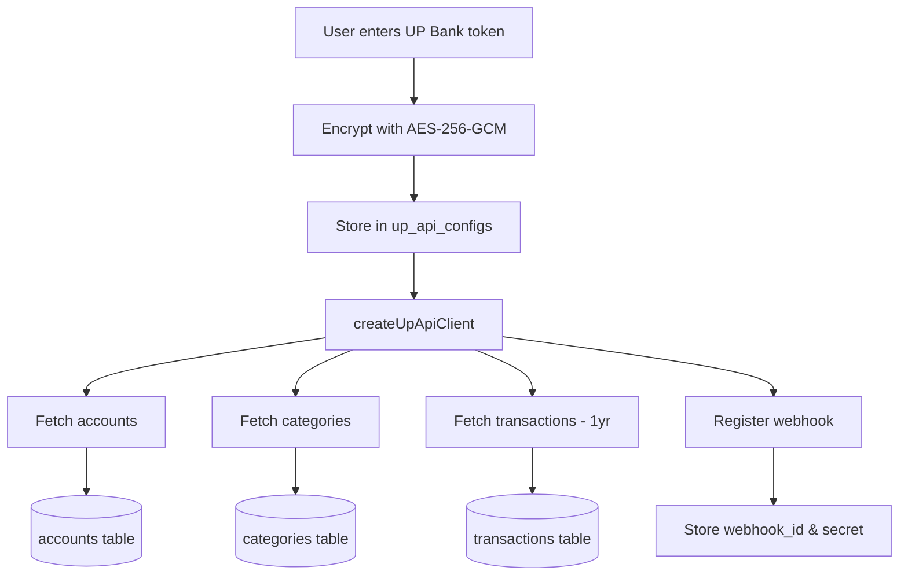
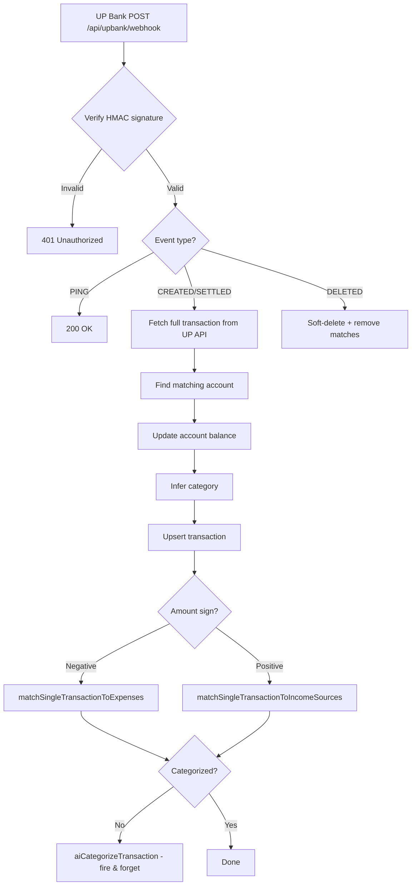
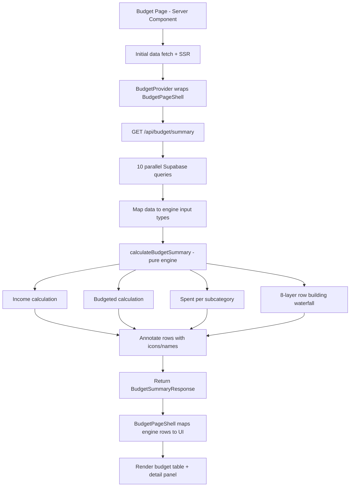

# Data Flows

This document describes the major data flows in PiggyBack, from external data ingestion through to user-facing features.

---

## 1. UP Bank to Supabase (Initial Sync)

Triggered during onboarding when the user provides their UP Bank personal access token.

### Flow



<details>
<summary>Text diagram</summary>

```
User enters UP Bank token
    |
    v
Token stored in `up_api_configs` table
    |
    v
createUpApiClient() creates authenticated API client
    |
    v
+-- Fetch all accounts --> upsert into `accounts` table
|   (GET /api/v1/accounts)
|
+-- Fetch all categories --> upsert into `categories` table
|   (GET /api/v1/categories)
|
+-- Fetch transactions (paginated, 1 year lookback)
|   (GET /api/v1/transactions?filter[since]=...)
|   --> upsert into `transactions` table
|
+-- Register webhook for real-time updates
    (POST /api/v1/webhooks)
    --> webhook_id and webhook_secret stored in `up_api_configs`
```
</details>

### Key Details

- **Token storage**: The UP Bank personal access token is encrypted with AES-256-GCM (via `encryptToken()` in `src/lib/token-encryption.ts`) and stored in the `encrypted_token` field of `up_api_configs`. Decryption uses `getPlaintextToken()` which also handles legacy plaintext tokens gracefully.
- **Account types**: UP Bank accounts can be `TRANSACTIONAL`, `SAVER`, or `HOME_LOAN`, with ownership types of `INDIVIDUAL` or `JOINT`.
- **Transaction pagination**: The UP Bank API paginates transactions. The sync fetches up to 1 year of history, following `next` pagination links until exhausted or the lookback limit is reached.
- **Upsert strategy**: Transactions are upserted using the composite key `(account_id, up_transaction_id)` to prevent duplicates.
- **Webhook endpoint**: The webhook is registered to point at `{WEBHOOK_BASE_URL}/api/upbank/webhook`.

---

## 2. UP Bank to Supabase (Webhook Real-Time)

After initial sync, UP Bank pushes transaction events in real-time via webhooks.

### Flow



<details>
<summary>Text diagram</summary>

```
UP Bank sends POST to /api/upbank/webhook
    |
    v
Parse JSON payload, extract webhook_id
    |
    v
Look up webhook_secret from `up_api_configs` (via service role client)
    |
    v
Verify HMAC-SHA256 signature (timing-safe comparison)
    |
    v
Route by event type:
    |
    +-- PING --> Return 200 OK (acknowledgment)
    |
    +-- TRANSACTION_CREATED / TRANSACTION_SETTLED
    |       |
    |       v
    |   Fetch full transaction details from UP API
    |   (GET /api/v1/transactions/{id})
    |       |
    |       v
    |   Find matching account in `accounts` table
    |       |
    |       v
    |   Update account balance from UP API
    |   (GET /api/v1/accounts/{id} --> update `accounts.balance_cents`)
    |       |
    |       v
    |   Infer category via inferCategoryId() (rule-based)
    |       |
    |       v
    |   Upsert transaction into `transactions` table
    |       |
    |       v
    |   Upsert any tags into `tags` and `transaction_tags`
    |       |
    |       v
    |   Post-processing (sequential, then fire-and-forget):
    |       +-- If negative amount: await matchSingleTransactionToExpenses()
    |       +-- Else if positive amount: await matchSingleTransactionToIncomeSources()
    |       +-- Then, if uncategorized: aiCategorizeTransaction().catch(...)
    |           (fire-and-forget, NOT awaited)
    |
    +-- TRANSACTION_DELETED
    |       |
    |       v
    |   Find local transaction by up_transaction_id
    |       |
    |       v
    |   Delete associated expense_matches
    |       |
    |       v
    |   Soft-delete transaction (set status to "DELETED")
```
</details>

### Key Details

- **Service role client**: The webhook handler uses `createServiceRoleClient()` to bypass RLS, since webhook requests arrive without a user session. Security is provided by HMAC signature verification.
- **Signature verification**: Uses `crypto.createHmac('sha256', secret)` with `crypto.timingSafeEqual()` to prevent timing attacks. The signature arrives in the `X-Up-Authenticity-Signature` header.
- **Balance updates**: When a transaction affects an account, the handler fetches the current balance from the UP API and updates all `accounts` rows matching that `up_account_id` (both partners may have rows for the same UP Bank account).
- **Transfer accounts**: If the transaction involves a transfer between accounts, both the source and destination account balances are updated.
- **Category inference**: `inferCategoryId()` uses rule-based logic (UP category ID, transfer detection, round-up detection, description matching, amount sign). The webhook handler separately calls `aiCategorizeTransaction()` as a fire-and-forget fallback if no category is determined.
- **Post-processing is NOT parallel**: Expense matching and income matching are mutually exclusive (based on amount sign) and each uses a sequential `await`. AI categorization is fire-and-forget (called without `await`, errors caught via `.catch()`). There is no `Promise.all` usage.
- **Error handling**: The handler returns appropriate HTTP status codes: 200 for success, 400 for invalid JSON, 401 for invalid signatures, 404 for unknown webhooks, and 500 for processing errors (so UP Bank retries delivery).

> [!WARNING]
> **TRANSACTION_DELETED has partial handling.** The webhook handler soft-deletes the transaction (sets status to "DELETED") and removes associated `expense_matches`. However, it does NOT reverse `next_due_date` advancement or update account balances. A deleted transaction that had already advanced an expense's `next_due_date` will leave it pointing to the wrong period.

---

## 3. Budget Calculation Flow

The budget system supports multiple methodologies (zero-based, 50/30/20, etc.) with all math handled by a pure calculation engine on the server.

### Flow



<details>
<summary>Text diagram</summary>

```
Budget page (Server Component)
    |
    v
Fetches budget record, expenses, category mappings, initial summary
    |
    v
Renders BudgetProvider + BudgetPageShell (Client Components)
    |
    v
BudgetProvider calls GET /api/budget/summary?budget_id=xxx&date=yyy
    |
    v
Summary API runs 10 parallel Supabase queries:
    +-- income_sources, budget_assignments, transactions (in period)
    +-- expense_definitions (with matched transaction categories)
    +-- couple_split_settings, category_mappings
    +-- budget_months (carryover), budget_layout_presets
    +-- savings_goals, investments
    |
    v
Maps query results to engine input types
    |
    v
calculateBudgetSummary() — pure engine, no DB access:
    +-- Calculate income (converted to target period)
    +-- Calculate budgeted (manual assignments + expense defaults)
    +-- Calculate spent per subcategory (with split adjustments)
    +-- TBB = income + carryover - budgeted
    +-- Build rows via 8-layer waterfall:
    |     1. Assignment rows (manual or expense-default override)
    |     2. Goal rows from assignments (name-resolved)
    |     3. Asset rows from assignments (name-resolved)
    |     4. Default goal rows (budgeted=0)
    |     5. Default asset rows (budgeted=0)
    |     6. Expense-default rows (unassigned subcategories)
    |     7. Unplanned spending rows (no assignment or default)
    |     8. Layout placeholder rows (from layout config)
    |
    v
Post-processing: annotate rows with icons, goal/asset names, metadata
    |
    v
BudgetPageShell maps engine rows → UI rows, renders table + panels
```
</details>

### Key Details

- **Pure engine**: All budget math lives in `src/lib/budget-engine.ts` — no database access, no side effects. The server fetches data and passes it in; the engine returns a complete `BudgetSummary`.
- **Single API endpoint**: `GET /api/budget/summary` replaces 21+ parallel queries that were previously done in `page.tsx`. Runs 10 parallel Supabase queries, maps data, runs the engine, and annotates rows.
- **Lean client provider**: `BudgetProvider` in `budget-context.tsx` holds the latest summary and dispatches actions (navigate, assign, refresh). No client-side caching or calculations — every action re-fetches from the server.
- **Expense defaults**: Recurring expenses auto-populate budget amounts via `countOccurrencesInPeriod` (anchor-based occurrence counting using `next_due_date`). Manual assignments take precedence.
- **Period types**: Weekly (month-aligned: 1-7, 8-14, 15-21, 22-end), Fortnightly (1-14, 15-end), Monthly. Periods are navigated via `getNextPeriodDate` / `getPreviousPeriodDate`.
- **Partner splits**: In individual view, both budgeted and spent amounts are adjusted by the user's split percentage. Resolution cascade: transaction override → expense-level → category-level → 100%.
- **Category mappings**: UP Bank `category_id` values are mapped to display parent/child names via `category_mappings`, used throughout for grouping and subcategory inference.
- **Expense subcategory inference**: Expense definitions don't store a category directly — it's inferred from matched transactions using a most-common-category heuristic.

---

## 4. AI Chat Flow

The AI assistant (Piggy Chat) provides conversational financial insights using the user's real data.

### Flow

```
User opens Piggy Chat floating panel
    |
    v
GET /api/ai/context
    |
    v
Build financial context snapshot:
    +-- Account balances (all active accounts)
    +-- Current month: income, spending, net
    +-- Last month spending (for comparison)
    +-- Spending by category (top 8)
    +-- Recent transactions (last 15)
    +-- Upcoming bills (next 14 days, from expense_definitions)
    +-- Savings goals progress
    |
    v
Return { context, hasApiKey } to client
    |
    v
User sends message
    |
    v
POST /api/ai/chat { messages }
    |
    v
Rate limit check (10 requests/minute per user via in-memory sliding window)
    |
    v
Load AI settings from profiles (provider, api_key, model)
    |
    v
Create provider-specific model:
    +-- Google: createGoogleGenerativeAI() -> gemini-2.0-flash
    +-- OpenAI: createOpenAI() -> gpt-4o-mini
    +-- Anthropic: createAnthropic() -> claude-sonnet-4-5-20250929
    |
    v
Wrap model with addToolInputExamplesMiddleware()
(serializes input examples for providers that don't natively support them)
    |
    v
Create 35 financial tools via createFinancialTools()
    |
    v
streamText() with:
    +-- System prompt (persona, date, tool descriptions, communication rules)
    +-- User messages (converted to model format)
    +-- 35 tools with Supabase access (RLS-enforced)
    +-- stepCountIs(15) stop condition (max 15 reasoning steps)
    +-- prepareStep: force tool use on first step (step 0),
    |   Gemini: force tool use for first 3 steps
    +-- experimental_repairToolCall: auto-fix broken tool calls
    |
    v
Streaming response rendered in chat UI
```

### AI Tools (35 total)

**Query Tools (14)** - Read financial data:
- `searchTransactions` - Find transactions by merchant, category, date, amount
- `getSpendingSummary` - Spending breakdown by category for any month
- `getIncomeSummary` - Income breakdown for any month
- `getAccountBalances` - Current account balances
- `getUpcomingBills` - Upcoming bills and due dates
- `getSavingsGoals` - Savings goal progress
- `getMonthlyTrends` - Multi-month spending/income trends
- `getMerchantSpending` - Deep-dive into a specific merchant
- `comparePeriods` - Side-by-side month comparison
- `getTopMerchants` - Top merchants ranked by spending
- `getBudgetStatus` - Budget vs. actual spending (supports multi-budget, period types, views)
- `getPaySchedule` - Pay schedule information
- `getCategoryList` - All spending categories with subcategories
- `getDailySpending` - Day-by-day spending breakdown

**Power Query Tool (1)**:
- `queryFinancialData` - Flexible custom queries against any financial table

**Detection Tools (2)**:
- `detectRecurringExpenses` - Detect recurring expense patterns in transactions
- `detectIncomePatterns` - Detect income patterns in transactions

**Analysis Tools (4)**:
- `getSpendingVelocity` - Current month burn rate and safe daily spend
- `getCashflowForecast` - Forward-looking cash flow projection
- `getSubscriptionCostTrajectory` - Subscription price tracking over time
- `getCoupleSplitAnalysis` - Partner expense split fairness analysis

**Financial Health and Planning Tools (5)**:
- `getFinancialHealth` - Full financial health snapshot (savings rate, emergency fund, goals progress, net worth trend, recommendations)
- `getNetWorthHistory` - Net worth trend over time with change tracking
- `getGoalDetails` - Deep goal info with status classification, contribution history, linked account balance
- `getInvestmentPortfolio` - Investment summary, performance metrics, top gainers/losers, rebalancing suggestions
- `getFIREProgress` - FIRE projections (progress, projected date, two-bucket breakdown, all variants, what-if scenarios)

**Action Tools (9)** - Write data (always confirmed with user first):
- `createBudget` - Create a new budget with name, type, period, and methodology
- `createBudgetAssignment` - Set budget amounts for categories or subcategories
- `createExpenseDefinition` - Add recurring bills/expenses
- `createSavingsGoal` - Create new savings goals
- `updateSavingsGoal` - Add funds or modify goals
- `recategorizeTransaction` - Fix transaction categories
- `createIncomeSource` - Add income sources
- `createInvestment` - Add investments (stocks, ETFs, crypto, property) to portfolio
- `updateInvestment` - Update investment values, quantities, or notes

### Key Details

- **Rate limiting**: The chat endpoint enforces a rate limit of 10 requests per minute per user via an in-memory sliding window (`src/lib/rate-limiter.ts`). Exceeded requests receive a 429 response with `Retry-After` header.
- **Tool-first approach**: The system prompt instructs the AI to call tools immediately rather than asking the user what to search for. The `prepareStep` callback enforces this by setting `toolChoice: "required"` on the first step.
- **Gemini workaround**: Gemini models are unreliable with tool calling under `auto` mode. The first 3 steps use `toolChoice: "required"` before switching to `auto`.
- **Tool repair**: `experimental_repairToolCall` handles broken tool calls (typos in tool names, invalid parameters) by finding the closest matching tool or skipping the broken call.
- **RLS enforcement**: All tool queries run through the user's authenticated Supabase client, so they can only access their own data.
- **Streaming**: Responses are streamed to the client using Vercel AI SDK's `toUIMessageStreamResponse()` for real-time rendering.

---

## 5. FIRE Calculation Flow

FIRE (Financial Independence, Retire Early) calculations help users project when they can achieve financial independence.

### Flow

```
User configures FIRE profile in Settings:
    +-- Date of birth
    +-- Target retirement age (or "as soon as possible")
    +-- Super balance (AUD)
    +-- Super contribution rate (default: 11.5% SG rate)
    +-- Expected annual return rate (e.g., 7%) — used for super bucket
    +-- Outside-super return rate (optional, falls back to expected return rate)
    +-- Income growth rate (annual %, e.g., 3.0)
    +-- Spending growth rate (annual %, e.g., 2.0 for inflation)
    +-- FIRE variant (lean / regular / fat / coast)
    +-- Optional: annual expense override
    |
    v
projectFireDate() receives:
    +-- FireProfile (user configuration)
    +-- SpendingData (from transactions):
    |   - monthlyEssentialsCents (essential spending only)
    |   - monthlyTotalSpendCents (all spending)
    |   - monthlyIncomeCents
    |   - savingsRatePercent
    |   - topCategories
    +-- InvestmentData:
        - outsideSuperCents (total investments outside super)
        - superBalanceCents
    |
    v
Step 1: Calculate annual expenses based on variant
    +-- Lean:    monthlyEssentials * 12
    +-- Regular: monthlyTotalSpend * 12
    +-- Fat:     monthlyTotalSpend * 12 * 1.25
    +-- Coast:   monthlyTotalSpend * 12 (but different target logic)
    +-- Override: use annualExpenseOverrideCents if set
    |
    v
Step 2: Calculate FIRE number
    = annualExpenses * 25 (using 4% safe withdrawal rate)
    |
    v
Step 3: Two-bucket strategy (Australian-specific)
    |
    +-- Outside-super bucket:
    |   Covers expenses from early retirement until preservation age (60)
    |   Target = annualExpenses * yearsPreRetirement
    |   (where yearsPreRetirement = max(0, 60 - targetRetirementAge))
    |
    +-- Super bucket:
    |   Covers expenses from preservation age onward
    |   Target = annualExpenses * 25
    |
    +-- Progress tracked separately for each bucket
    |
    v
Step 4: Year-by-year projection
    For each year from current age to target:
    +-- Project outside-super growth (contributions + returns)
    +-- Project super growth (employer SG + returns)
    +-- Track total vs. FIRE target
    +-- Identify crossover year (projected FIRE date)
    |
    v
Step 5: Calculate all FIRE variants for comparison
    +-- Lean FIRE: 25x essential spending
    +-- Regular FIRE: 25x total spending
    +-- Fat FIRE: 25x total spending * 1.25
    +-- Coast FIRE: amount needed NOW such that compound growth alone
    |   reaches FIRE number by target age (no further contributions)
    |   Formula: fireNumber / (1 + returnRate)^yearsToTarget
    |
    v
Step 6: Generate recommendations
    Based on gaps and progress:
    +-- "cut-spending" (high priority if spending is high relative to income)
    +-- "increase-income" (medium priority)
    +-- "salary-sacrifice" (medium priority if super is behind)
    +-- "on-track" (low priority, encouragement)
    +-- "coast-achieved" (if current investments already exceed coast number)
```

### Key Constants

| Constant | Value | Description |
|----------|-------|-------------|
| `PRESERVATION_AGE` | 60 | Australian super preservation age |
| `AGE_PENSION_AGE` | 67 | Australian Age Pension eligibility |
| `SAFE_WITHDRAWAL_RATE` | 0.04 (4%) | Standard safe withdrawal rate |
| `FIRE_MULTIPLIER` | 25 | 1 / SWR, used to calculate FIRE number |
| `FAT_FIRE_MULTIPLIER` | 1.25 | Fat FIRE spending multiplier over regular |
| `DEFAULT_SG_RATE` | 11.5% | Default superannuation guarantee rate (2025-26) |

### Key Details

- **Pure functions**: All FIRE calculations are pure functions with no side effects or database access. They live in `src/lib/fire-calculations.ts`.
- **Australian-specific**: The two-bucket strategy accounts for the Australian superannuation system where super funds are locked until preservation age (60). Early retirees need enough outside-super investments to bridge the gap.
- **Coast FIRE**: A variant where you have enough invested that compound growth alone will reach your FIRE number by the target age, meaning you no longer need to save -- just cover current expenses.
- **Spending classification**: The system classifies spending into "essential" and "discretionary" categories to support lean FIRE calculations. This is handled by the fire spending classifier (`src/lib/fire-spending-classifier.ts`).
- **Projection data**: Year-by-year projection data is returned as an array of `ProjectionYear` objects, which feed into the FIRE projection chart on the settings page.

---

## 6. Webhook-Driven Syncing

Goal balances and net worth snapshots are automatically updated in real-time by the UP Bank webhook handler whenever account balances change. See `/api/upbank/webhook` above.

When a linked saver account balance changes, the webhook handler:
1. Diffs the old vs new balance on `savings_goals.current_amount_cents`
2. Updates the goal's `current_amount_cents` to match the saver balance
3. Records a `goal_contributions` entry with `source: 'webhook_sync'` and the delta amount
4. Auto-completes the goal if the new balance >= target

Manual fund additions via `addFundsToGoal` also record contributions (source: `manual`) and check milestone thresholds (25%, 50%, 75%, 100%) for notifications.

### Goal Calculations (`src/lib/goal-calculations.ts`)

Pure utility functions for goal analytics:
- `aggregateGoalHistory()` — Combines contributions across goals into a savings timeline for charts
- `aggregateSingleGoalHistory()` — Builds history timeline for a single goal
- `calculateSavingsRate()` — Average daily/weekly/monthly savings rate from recent contributions
- `calculateProjectedCompletion()` — Estimated completion date using actual rate or budget allocation
- `classifyGoalStatus()` — Classifies as on-track / ahead / behind / overdue / no-deadline / completed
- `calculateSuggestedSavings()` — Weekly / fortnightly / monthly amounts needed to reach goal by deadline
- `getStartDateForPeriod()` — Calculates the start date for a given period string
